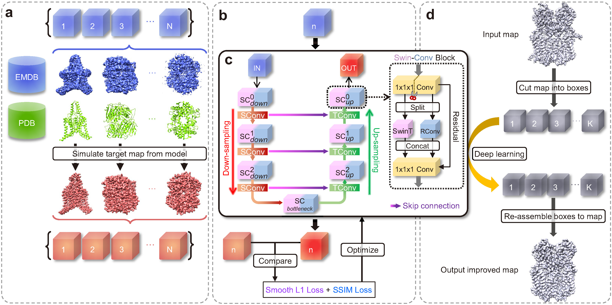

# EMReady

## 📄 Overview

Improvement of cryo-EM maps by simultaneous local and non-local deep learning

<a href="#"></a>   <a href="https://www.gnu.org/licenses/gpl-3.0.en.html#license-text"></a>

<a href="https://pytorch.org/"></a>   <a href="https://developer.nvidia.com/cuda-toolkit"></a>   <a href="https://python.org"></a>

Copyright (C) 2023 Jiahua He, Tao Li, Sheng-You Huang and Huazhong University of Science and Technology




## ✨ Requirements

**Platform**: Linux (Mainly tested on CentOS 7).

**GPU**: A GPU with >10 GB memory is required, advanced GPU like A100 is recommended.


## ⚡ Installation

#### 1. Download EMReady

Download EMReady via github
```
git clone https://github.com/huang-laboratory/EMReady.git
cd EMReady
```

### 2. Create conda environment
```
conda env create -f environment.yml
```
If conda fails, you could install the packages youself. Basically. you can first create an environment named **emready_env** by conda env create -n **emready_env** python=3.9, then install the packages listed in environment.yml using conda or pip.

### 3. Set the executable file
Set **"EMReady_home"** to the root directory of EMReady, for example, if EMReady is unzipped to "/home/data/EMReady", set `EMReady_home="/home/data/EMReady"`

Set **"active"** to path of conda activator, for example
```
activate="/home/data/anaconda3/bin/activate
```

set **"EMReady_env"** to name of the python conda virtual environment that have all the required packages installed. An conda environment named "emready_env" will be created using the quick installation command, so `EMReady_env="emready_env"`. If the environment is built with a different name, users should modify **"EMReady_env"** accordingly.


## 🎯 Usage
Running EMReady is very straight forward with one command like
```
EMReady.sh in_map.mrc out_map.mrc [Options]
```
Required arguments:
```     
in_map.mrc:  File name of input EM density map in MRC2014 format.
out_map.mrc:  File name of the output EMReady-processed density map.
```

Options:
```
-g  GPU_ID:  ID(s) of GPU devices to use. e.g. '0' for GPU #0, and '2,3,6' for GPUs #2, #3, and #6. (default: '0')
-s  STRIDE:  The step of the sliding window for cutting the input map into overlapping boxes. Its value should be an integer within [12,48]. (default: 12)
-b  BATCH_SIZE:  Number of boxes input into EMReady in one batch. (default: 10)
-m  MASK_MAP:  Input mask map in MRC2014 format. (default: None)
-c  MASK_MAP_CONTOUR:  Set the contour level of the mask. (default: 0.0)
-p  MASK_STRUCTURE:  Input structure mask files in PDB or CIF format (default: None)
-r  MASK_STRUCTURE_RADIUS:  Zone radius in angstroms (default: 4.0)
-mo  MASK_OUT_PATH:  File path of the output binary mask map. (default: None)
--use_cpu:  Run EMReady on CPU instead of GPU.
```
<br>

**Notes:**
1. Users can specify a larger STRIDE of sliding window (default=**12**) to reduce the number of overlapping boxes to calculate. If users run out of memory, they may set it to a larger value. Howerver, since the size of the overlapping boxes is 48×48×48, the value of STRIDE should not exceed 48.

2. By default, EMReady will run on GPU(s). Users can adjust the BATCH_SIZE according to the VRAM of their GPU. Empirically, an NVIDIA A100 with 40 GB VRAM can afford a BATCH_SIZE of 200. Users can run EMReady on CPUs by setting --use_cpu. But this may take very long time for large density maps.


## 📝 Citation

If you find our work useful, please cite our related paper:
```
@article{EMReady2023,
	title = {Improvement of cryo-EM maps by simultaneous local and non-local deep learning},
	author = {He J, Li T, Huang SY},
	journal = {Nature communications},
	year = {2023},
	volume = {14},
	number = {1},
	pages = {3217},
	doi = {https://doi.org/10.1038/s41467-023-39031-1}
}
```