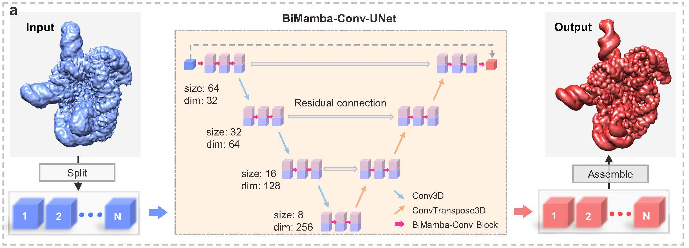

# EMReady v2.1.2

All historical versions and downloadable assets can be found on the project Releases page.

## 📄 Overview

EMReady2: Improvement of cryo-EM and cryo-ET maps by local quality-aware deep learning with Mamba

<a href="#"></a>  <a href="https://mit-license.org/"></a>

<a href="https://pytorch.org/"></a>   <a href="https://developer.nvidia.com/cuda-toolkit"></a>   <a href="https://python.org"></a>




## ✨ Requirements

**Platform**: Linux (Mainly tested on CentOS 7 and Ubuntu).

**GPU**: A GPU with >10 GB memory is recommended. Advanced GPU like A100 is recommended for large maps.

**CUDA**: CUDA>=11.8 is required because mamba needs it.


## ⚡ Installation

<details>
	<summary>1. Download EMReady</summary>

```bash
git clone https://github.com/huang-laboratory/EMReady.git
cd EMReady
```
</details>

<details>
	<summary>2. Create conda environment</summary>

```bash
conda create -n emready python==3.10
conda activate emready
```
</details>

<details>
	<summary>3. Install packages</summary>

```bash
pip install torch==2.4.1 torchvision==0.19.1 torchaudio==2.4.1 --index-url https://download.pytorch.org/whl/cu118
pip install -r requirements.txt
```
</details>

<details>
	<summary>4. Install mamba</summary>

```bash
pip install -r requirements_mamba.txt
```


If **requirements_mamba.txt** fails to install, possibly due to network fluctuations, you can also check the emready environment using the following two lines of code and download the corresponding version from the official website.

**Check the torch version and cuda version**
```python
python -c "import torch; print(torch.__version__); print(torch.version.cuda)"
```
Expected Output:
```
2.4.1+cu118
11.8
```

**Check the CXX11 ABI settings of PyTorch**
```python
python -c 'import torch; print(torch._C._GLIBCXX_USE_CXX11_ABI); print(torch.compiled_with_cxx11_abi())'
```
Possible Output:
```
False or True
```
Download **causal-conv1d==1.4.0** from [https://github.com/Dao-AILab/causal-conv1d/releases/tag/v1.4.0](https://github.com/Dao-AILab/causal-conv1d/releases/tag/v1.4.0)
Download **mamba-ssm==2.2.0** from [https://github.com/state-spaces/mamba/releases/tag/v2.2.0](https://github.com/state-spaces/mamba/releases/tag/v2.2.0)

Manually install it locally in the "emready" environment, replacing 'xxx' with the corresponding version.
```bash
pip install causal_conv1d-1.4.0_xxx.whl
pip install mamba_ssm-2.2.0_xxx.whl
```
</details>

<details>
	<summary>5. Install EMReady</summary>

EMReady is now used as an installable Python package in the conda environment:
```bash
pip install -e . --no-deps
```
</details>

<details>
	<summary>6. Download model weights</summary>

Due to the limitations imposed by GitHub on large files, users should download the trained model weights separately and put them under **model_weights/**:

The pretrained model weights can be downloaded from the EMReady2 page of Huang Laboratory:
```text
http://huanglab.phys.hust.edu.cn/EMReady2
```

```bash
model_weights/model_0p6.pt
model_weights/model_1p0.pt
model_weights/model_ligand_v0.pt
model_weights/model_main_chain_v0.pt
```
</details>


## 🎯 Usage

### 1. Main command

Running EMReady is straightforward with one command like
```bash
emready in_map.mrc out_map.mrc [Options]
```

<details>
	<summary>Required arguments:</summary>

```
in_map.mrc:   File name of input EM density map in MRC2014 format.
out_map.mrc:  File name of the output EMReady-processed density map.
```
</details>

<details>
	<summary>Common options:</summary>

```
-g GPU_ID:  ID(s) of GPU devices to use. e.g. '0' for GPU #0, and '2,3,6' for GPUs #2, #3, and #6. (default: '0')
-s STRIDE:  The step of the sliding window for cutting the input map into overlapping boxes. Its value should be an integer within [6,64]. (default: 16)
-b BATCH_SIZE:  Number of boxes input into EMReady in one batch. (default: 16)
-m/-mm MASK_MAP:  Input mask map in MRC2014 format. (default: None)
-c/-mc MASK_MAP_CONTOUR:  Set the contour level of the mask. (default: 0.0)
-p/-ms MASK_STRUCTURE:  Input structure mask files in PDB or CIF format. (default: None)
-r/-mr MASK_STRUCTURE_RADIUS:  Zone radius in angstroms. (default: 4.0)
-mo MASK_OUT_PATH:  File path of the output binary mask map. (default: None)
--inverse_mask:  Invert mask keep/remove logic for --mask_map or --mask_str. (default: False)
```
</details>

<details>
	<summary>Examples:</summary>

```bash
emready input.mrc output.mrc -g 0 -b 128 -s 16
emready input.mrc output.mrc -m mask.mrc -c 0.5
emready input.mrc output.mrc -p struct.pdb -r 4.0 --inverse_mask
```
</details>

### 2. Ligand detection

Predict ligand density maps from an experimental density map with
```bash
emready.ligand in_map.mrc out_dir [Options]
```

<details>
	<summary>Required arguments:</summary>

```
in_map.mrc:  File name of input EM density map in MRC2014 format.
out_dir:     Output directory for ligand maps.
```
</details>

<details>
	<summary>Output files:</summary>

```
ligand.mrc:       Ligand density map (similarity weighted by ligand-class probability).
ligand_mask.mrc:  Binary ligand mask (1 for ligand voxels, 0 otherwise).
```
</details>

<details>
	<summary>Common options:</summary>

```
-g GPU_ID:  ID(s) of GPU devices to use. e.g. '0' for GPU #0, and '2,3,6' for GPUs #2, #3, and #6. (default: '0')
-s STRIDE:  The step of the sliding window for cutting the input map into overlapping boxes. Its value should be an integer within [16,48]. (default: 16)
-b BATCH_SIZE:  Number of boxes input into EMReady in one batch. (default: 8)
```
</details>

<details>
	<summary>Examples:</summary>

```bash
emready.ligand input.mrc out_dir -g 0 -b 8 -s 16
emready.ligand -i input.mrc -o out_dir -g 0
```
</details>

### 3. Main chain prediction and structure class annotation

Predict main-chain density and segment structure classes from an experimental density map with
```bash
emready.main_chain in_map.mrc out_dir [Options]
```

<details>
	<summary>Required arguments:</summary>

```
in_map.mrc:  File name of input EM density map in MRC2014 format.
out_dir:     Output directory for main-chain maps.
```
</details>

<details>
	<summary>Output files:</summary>

```
main_chain.mrc:        Main-chain density map.
main_chain_class.mrc:  Structure class annotation map (0/1/2 for background/protein/nucleic acid).
```
</details>

<details>
	<summary>Common options:</summary>

```
-g GPU_ID:  ID(s) of GPU devices to use. (default: '0')
-s STRIDE:  Sliding-window stride. integer within [16,48]. (default: 32)
-b BATCH_SIZE:  Number of boxes per batch. (default: 8)
```
</details>

<details>
	<summary>Examples:</summary>

```bash
emready.main_chain input.mrc out_dir -g 0 -b 8 -s 32
emready.main_chain -i input.mrc -o out_dir -g 0
```
</details>


## 🔥 Trouble shooting

- **model weights:** If EMReady reports that no default model weight is found, please check that the downloaded files are placed at
  `model_weights/model_0p6.pt` and `model_weights/model_1p0.pt`.
  For the ligand command, also place `model_weights/model_ligand_v0.pt`.
  For the main_chain command, also place `model_weights/model_main_chain_v0.pt`.


## 🔄 Updates

<details>
   <summary>2026/03/02. Compatibility update for torch and mamba.</summary>

EMReady2 was updated to fix the compatibility issues between torch and mamba.
Specifically, the runtime environment was upgraded from torch 2.3 to torch 2.4.1.
</details>

<details>
   <summary>2026/05/01. Simplified installation and added Gaussian post-processing.</summary>

The installation workflow was simplified from the old shell-script based usage to
an installable Python package workflow in a conda environment.

Gaussian post-processing was added as the default patch aggregation method.
On the EMReady2 118 cryo-EM test set, the comparison is as follows:

```text
methods     mfsc0.5   umfsc0.5   qscore   ccbox   ccmask   ccpeaks   qscore_mc
average     4.589     4.647      0.493    0.859   0.748    0.717     0.557
gaussian    4.543     4.601      0.494    0.861   0.750    0.720     0.558
```
</details>

<details>
	<summary>2026/06/30. Improved the readability of the main program.</summary>

Make the options parameter of EMReady2 compatible with the same usage as that of EMReady.
</details>

<details>
	<summary>2026/07/24. Added ligand density prediction.</summary>

EMReady was updated to v2.1.1 with a new `emready.ligand` command for ligand density
prediction from experimental maps. The ligand model weight file is
`model_weights/model_ligand_v0.pt`.
</details>

<details>
	<summary>2026/07/29. Added main-chain prediction and structure class annotation.</summary>

EMReady was updated to v2.1.2 with a new `emready.main_chain` command for joint
main-chain density prediction and structure class annotation (0/1/2 for
background/protein/nucleic acid) from experimental maps. The main-chain model
weight file is `model_weights/model_main_chain_v0.pt`.
</details>


## 📝 Citation

If you find our work useful, please cite our related paper:
```
@article{EMReady2,
	title = {EMReady2: improvement of cryo-EM and cryo-ET maps by local quality-aware deep learning with Mamba},
	author = {Hong Cao, Yueting Zhu, Tao Li, Ji Chen, Jiahua He, Xinggang Wang, Sheng-You Huang},
	journal = {Nature Communications},
	year = {2026},
	doi = {https://doi.org/10.1038/s41467-026-71794-1},
}

@article{EMReady,
	title = {Improvement of cryo-EM maps by simultaneous local and non-local deep learning},
	author = {He J, Li T, Huang SY},
	journal = {Nature communications},
	year = {2023},
	volume = {14},
	number = {1},
	pages = {3217},
	doi = {10.1038/s41467-023-39031-1}
}
```
